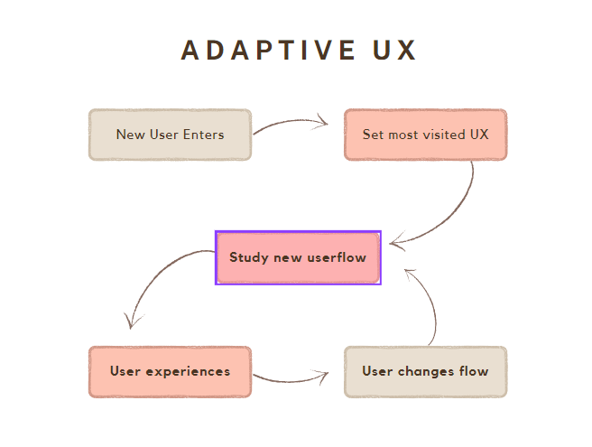

# Ideas

- Quick shortcut automatically added when a user flow repeated more than twice.
- Reordering stack of links descending by number of  clicks.
- Decrease number of steps and combine user`s choices when a repeated flow happens.
- Use specific UX tests for individual users.